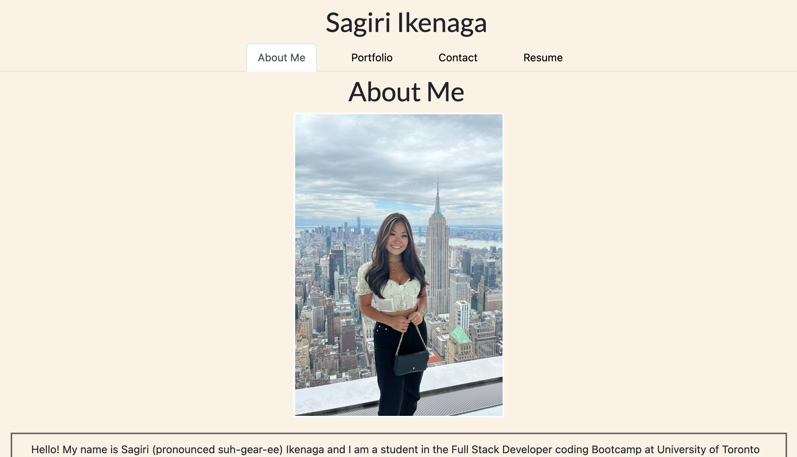

# Module 20 Challenge: React Portfolio

## Description

This project was built so that I can demonstrate my knowledge on React.js and everything I have learned thus far in the course in order to create a personal portfolio. It allowed me to showcase my projects from throughout the course into a polished and interactive user interface using React.js. 

## Usage

This website serves as a personal portfolio that renders a section with information about myself, a portfolio section with my work and corresponding links, a contact form, and a resume section that includes a download option.

## Deployed Application

The live page is found at https://sagirikenaga.github.io/react-portfolio/. 

## Demo

The webpage appears as the following:

## Credits

Sagiri Ikenaga
